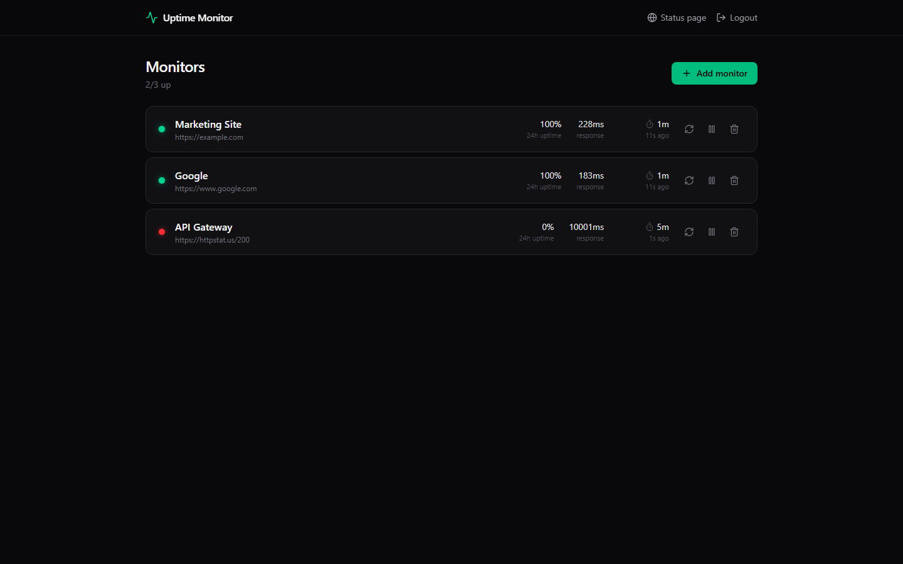

# 📡 Uptime Monitor

[](LICENSE)
[](https://nodejs.org)

**Self-hosted uptime monitoring + a beautiful public status page. Pay once. Own it forever. No subscription.**

UptimeRobot charges $8/mo. Pingdom starts at $10/mo. Both cap your monitors, hold your status page hostage behind higher tiers, and keep billing you forever. Uptime Monitor is the same core product — HTTP checks, incident tracking, alerting, a classic 90-day-bar status page — running on **your own $5 VPS** (or your desktop) with unlimited monitors and zero recurring fees.

Built for agencies: monitor every client site from one box, hand clients a clean branded status page, get pinged the second something breaks.



## Features

- **HTTP(S) monitors** — URL, check interval from 30s to 15m, optional expected status code, optional keyword match ("is the word *checkout* actually on the page?")
- **In-process checker loop** — no cron, no workers, no Redis; one Node process does everything
- **SQLite storage** — check history (status, response ms, timestamp) with automatic 90-day retention pruning
- **Per-monitor detail** — uptime % for 24h / 7d / 30d, response-time sparkline, full incident log of every down/recovery transition
- **Public status page at `/status`** — no auth, clean branded page, per-monitor up/down badges + classic 90-day uptime bars, overall banner (operational / partial / major outage)
- **Alerts on down + recovery** — JSON webhook (Slack/Discord-compatible) and email via your own SMTP (nodemailer, BYO credentials)
- **Pause / resume / delete / check-now** from the dashboard
- **Admin auth** — single password from `.env`, session cookie, nothing external
- **Dark, modern UI** — React + Tailwind + Framer Motion + Lucide

## Two ways to run it

> Run it as a desktop app, or deploy to a $5 VPS when you need it public.

### 🖥️ Desktop mode

```bash
npm install
npm run build
npm run desktop
```

An Electron window opens with the full app, auto-logged-in as admin. Data lives in your OS user-data folder. Great for keeping an eye on client sites from your own machine.

### 🌐 VPS / server mode

```bash
npm install
npm run build
cp .env.example .env   # set ADMIN_PASSWORD (and SMTP/webhook if you want alerts)
npm start              # http://localhost:5301
```

Your public status page is at `http://your-server:5301/status` — share it with clients. The admin dashboard is everything else, behind your password.

### 🐳 Docker

```bash
ADMIN_PASSWORD=supersecret docker compose up -d
```

The SQLite database persists in the `uptime-data` volume.

## Configuration (`.env`)

| Variable | Default | Purpose |
|---|---|---|
| `PORT` | `5301` | HTTP port |
| `ADMIN_PASSWORD` | — | Admin dashboard password (required in server mode) |
| `STATUS_PAGE_NAME` | `Service Status` | Brand name on the public status page |
| `RETENTION_DAYS` | `90` | Days of check history to keep |
| `CHECK_TIMEOUT_MS` | `10000` | Per-check HTTP timeout |
| `ALERT_WEBHOOK_URL` | — | Global webhook POSTed on down/recovery (per-monitor webhooks also supported) |
| `SMTP_HOST/PORT/USER/PASS/FROM` | — | BYO SMTP for email alerts |
| `ALERT_EMAIL_TO` | — | Where alert emails go |

## Uptime Monitor vs. the subscriptions

| | **Uptime Monitor** | UptimeRobot | Pingdom |
|---|---|---|---|
| Price | **$39 once** | $8/mo forever ($96/yr) | $10+/mo forever ($120+/yr) |
| Monitors | **Unlimited** | 50 on paid tier | Priced per check volume |
| Check interval | 30s | 60s (paid) | 60s |
| Public status page | **Included, branded** | Limited / upsell | Add-on |
| Keyword checks | **Included** | Paid tier | Paid tier |
| Your data | **Your SQLite file on your box** | Their cloud | Their cloud |
| Multi-client agency use | **One VPS monitors everything** | Per-account limits | Per-account pricing |

*Pays for itself vs UptimeRobot in under 5 months — then it's free forever.*

## ☕ Skip the setup — get the 1-click installer

Want the packaged, zero-config version (Windows installer, auto-updates, priority support)? Grab it on Whop:

**→ [https://whop.com/benjisaiempire/upwatch](https://whop.com/benjisaiempire/upwatch)**

The source here is MIT and always will be — the paid version is pure convenience.

## Tech stack

- **Backend:** Node 20+, Express 4, better-sqlite3 (WAL), nodemailer
- **Frontend:** React 18 + Vite 6, Tailwind CSS 4, Framer Motion, Lucide icons
- **Desktop:** thin Electron wrapper around the same server (electron-builder NSIS config included)
- **Checker:** in-process scheduler (5s tick, per-monitor intervals), AbortController timeouts

## Development

```bash
npm run dev      # Vite dev server on :5302, proxying /api to :5301
npm start        # API server
npm test         # end-to-end smoke test (real server, real HTTP target, real SQLite)
```

## License

MIT © 2026 Ben ([bensblueprints](https://github.com/bensblueprints))

## macOS build

See [MAC-BUILD.md](MAC-BUILD.md). Quickest path: GitHub **Actions** tab -> run the **Mac Build** (`mac-build.yml`) workflow to get a downloadable `.dmg` (unsigned - right-click -> Open on first launch).
